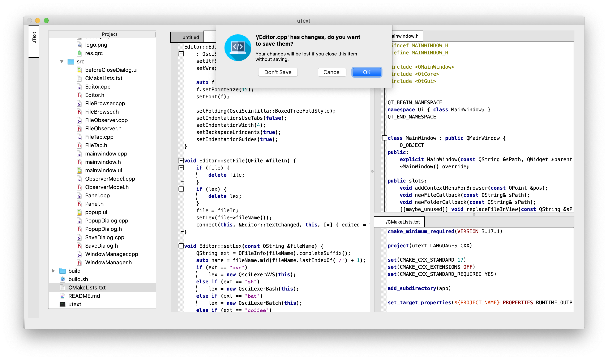

uText
=============

uText is simple cross-platform UTF-8 text editor based on Qt and Scintilla. uText aims to provide similar workflow as [Notepad++](https://notepad-plus-plus.org) does.

## Preview:

## Required software:
  - any `C++ compiler` supported `17 standard` and higher;
  - `qmake`;
  - `make`;
  - `cmake` `v3.17` and higher;
  - `Qt5`.

Downloads
---------
* [stable releases](https://github.com/Hvvang/uText/releases/tag/1.0).

How to build
------------
Run [`./build.sh`](https://github.com/Hvvang/uText/blob/main/build.sh).

## License
Collision is an open-sourced software licensed under the [MIT license](LICENSE).
